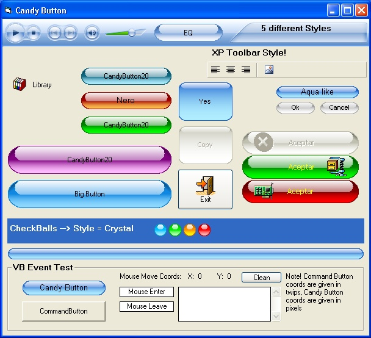



## Candy Button \(3rd Update\) Rev2

### Description

Candy Button - is a nice button that can look like XP button, XP Toolbar button, Cristal (OSX) and IceBlock (Based on Cristal) all buttons can have Checked/Unchecked state. Use it if you like, I have seen some buttons here that are forbidden for commercial use and I think it's absurd!! This is a small gift to this community.

Features *Small api usage (only 4 apis)

*4 different styles

Some votes wouldn't be bad! ;)

----

Updates: Now is Subclassed!!!!(No Timer) *Code was

sorted and reduced *Drawing now is faster!!!

*Font propertys (thank's Kenneth Foster!) *No more green background, no flickering problem or Click event outside the button

Thank's to all for your opinions, suggestions and solutions!!!(and of course for the votes!)

(now around 10 apis are used). Tell me what you think, it was tested only for xp.

----

*Some bugs in design mode fixed (Special thank's to Heriberto and Ken Foster) *Subclass method now sorted (Thank's to Paul Caton for his advise)*Introduced a new button style: Plastic.

I hope you like it ;)

----

News: Some bugs were fixed, speed was really improved (and I mean a lot!), and new properties were added (thanks to Steppenwolfe) Enjoy it! And don't forget to leave a feedback ;)

----

Small bugs fixed and speed was improved again, know it should be fast for almost any purpose. Check it out!!! :o

1 Last revision for those who could not load the style.
 
### More Info
 

             |
---                |---
**Submitted On**   |2006-04-13 20:27:20
**By**             |[Mario Villanueva](https://github.com/Planet-Source-Code/PSCIndex/blob/master/ByAuthor/mario-villanueva.md)
**Level**          |Beginner
**User Rating**    |4.9 (409 globes from 83 users)
**Compatibility**  |VB 6\.0
**Category**       |[Custom Controls/ Forms/  Menus](https://github.com/Planet-Source-Code/PSCIndex/blob/master/ByCategory/custom-controls-forms-menus__1-4.md)
**World**          |[Visual Basic](https://github.com/Planet-Source-Code/PSCIndex/blob/master/ByWorld/visual-basic.md)
**Archive File**   |[Candy\_Butt2048322172007\.zip](https://github.com/Planet-Source-Code/mario-villanueva-candy-button-3rd-update-rev2__1-64969/archive/master.zip)

### API Declarations

Several

